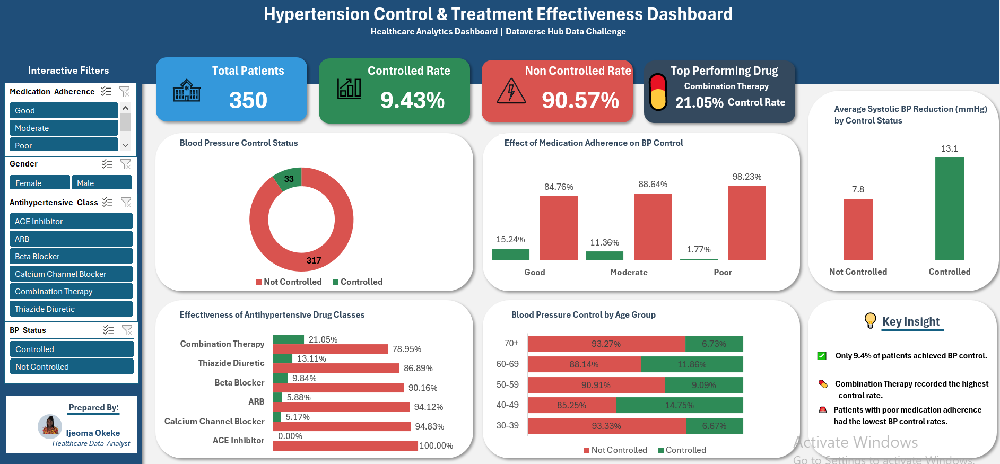

# 🩺 Hypertension Treatment Effectiveness Analysis using SQL Server & Microsoft Excel


A healthcare analytics project using **SQL Server** and **Microsoft Excel** to evaluate hypertension treatment outcomes through exploratory data analysis, KPI development, and an interactive Excel dashboard.

---

## 📊 Dashboard Preview



---

## 📌 Project Overview

Hypertension is one of the leading risk factors for cardiovascular diseases worldwide. This project analyzes hypertension treatment outcomes after three months, with a focus on evaluating blood pressure control, medication adherence, and the effectiveness of different antihypertensive drug classes.

The analysis combines **SQL Server** for data exploration and validation with **Microsoft Excel** for dashboard development and visualization, transforming raw healthcare data into actionable insights for decision-making.

---

## 🎯 Objectives

- Assess blood pressure control after three months of treatment.
- Evaluate the impact of medication adherence on treatment outcomes.
- Compare the effectiveness of antihypertensive drug classes.
- Develop an interactive healthcare dashboard.
- Present findings through data storytelling and business reporting.

---

## 🛠️ Tools Used

- SQL Server Management Studio (SSMS)
- Microsoft Excel
- Pivot Tables & Pivot Charts
- Slicers
- Conditional Formatting
- Git & GitHub

---

## 📂 Project Workflow

```text
Dataset
    │
    ▼
SQL Server
(Data Exploration & Validation)
    │
    ▼
Microsoft Excel
(Data Preparation & Dashboard Development)
    │
    ▼
Interactive Dashboard
    │
    ▼
Business Insights & Recommendations
```

---

## 🔍 SQL Analysis

SQL Server was used to:

- Explore the dataset.
- Validate data quality.
- Check for duplicate records.
- Identify missing values.
- Analyze blood pressure control outcomes.
- Evaluate medication adherence.
- Compare the effectiveness of antihypertensive drug classes.

---

## 📊 Dashboard Features

The interactive dashboard includes:

- 👥 Total Patients KPI
- ✅ BP Control Rate
- ❌ Non-Controlled Rate
- 💊 Top Performing Drug Class
- 📈 Medication Adherence Analysis
- 📊 Drug Class Effectiveness
- ❤️ Average Diastolic Blood Pressure Reduction
- 👨‍⚕️ Blood Pressure Control by Age Group
- 🎛️ Interactive Slicers

---

## 📌 Key Findings

- A total of **350 patient records** were analyzed.
- **9.43%** of patients achieved blood pressure control after three months.
- **90.57%** of patients remained uncontrolled.
- Patients with **good medication adherence** demonstrated better treatment outcomes.
- **Combination Therapy** recorded the highest blood pressure control rate among the treatment options evaluated.

---

## 💡 Recommendations

- Improve patient education to increase medication adherence.
- Strengthen follow-up monitoring for patients with uncontrolled blood pressure.
- Support treatment decisions with continuous data monitoring.
- Use dashboards to communicate treatment outcomes effectively.

---

## 📁 Repository Structure

```text
Hypertension-Control-Treatment-Effectiveness-Analysis
│
├── Dashboard
├── Images
├── Presentation
├── Report
├── SQL
├── LICENSE
└── README.md
```

---

## 📚 Skills Demonstrated

- SQL Querying
- Data Validation
- Exploratory Data Analysis (EDA)
- Healthcare Data Analysis
- KPI Development
- Excel Dashboard Design
- Data Visualization
- Business Reporting
- Data Storytelling

---

## 📖 What I Learned

Working on this project strengthened my ability to:

- Perform healthcare data analysis using SQL Server.
- Validate and prepare data before visualization.
- Build interactive dashboards using Microsoft Excel.
- Present analytical findings through reports and presentations.
- Translate raw data into actionable business insights.

This project reinforced the importance of combining technical analysis with effective communication to support informed decision-making.

---

## 🚀 Future Improvements

- Develop a predictive machine learning model for blood pressure treatment outcomes.
- Build an interactive Power BI dashboard.
- Deploy the dashboard as a web application.
- Expand the analysis with larger healthcare datasets.

---

## 👩🏽‍💻 Author

**Ijeoma Okeke**

**Data Analyst | Excel | SQL | Python | Power BI**

📍 Nigeria

🔗 LinkedIn: www.linkedin.com/in/ijeoma-okeke-53123829b

---

⭐ *If you found this project interesting, feel free to explore the repository or connect with me on LinkedIn!*
---
